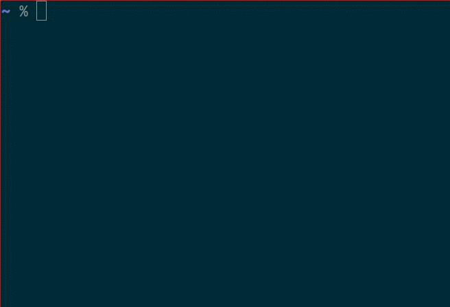

# zsh-bd

Quickly go back to a specific parent directory instead of typing `cd ../../..` redundantly

---

This is a reimplementation of
[vigneshwaranr/bd](https://github.com/vigneshwaranr/bd) that utilizes the power
of the zsh shell.

## Install

All you need to do is to source `bd.zsh`. Here's the manual installation

    mkdir -p $HOME/.zsh/plugins/bd
    curl https://raw.githubusercontent.com/Tarrasch/zsh-bd/master/bd.zsh > $HOME/.zsh/plugins/bd/bd.zsh
    print -- "\n# zsh-bd\n. \$HOME/.zsh/plugins/bd/bd.zsh" >> $HOME/.zshrc

Restart your shell (or run `zsh`)

### [Antigen](https://github.com/zsh-users/antigen)

If you prefer antigen over manual installation

    antigen-bundle Tarrasch/zsh-bd

## Usage

    $ mkdir -p a/b/c/d
    $ cd a/b/c/d
    $ bd b
    $ ls
    c
    $ cd c/d
    $ bd 2
    $ ls
    c

Here's an animation also showing the completion functionality

## Thanks

Thanks to
[@vigneshwaranr](https://github.com/vigneshwaranr)
for inspiring me to do a zsh version.

Thanks to [@voria](https://github.com/voria) for many useful
patches! (see commit log)
